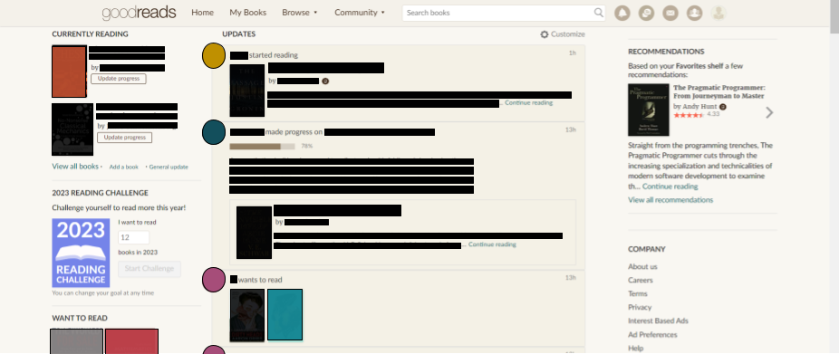
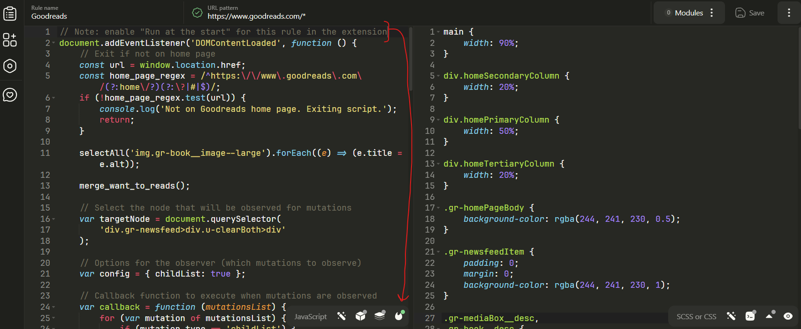

The main goal of this custom JS and CSS is to increase the content-density of the Goodreads homepage and reduce excessive whitespace.

# What this does

1. Groups all wants-to-read updates into ONE post per person. These per-person posts update automatically as you scroll down and more posts are loaded.
2. Makes news-feed items smaller by hiding the comment bar and `like` and `comment` buttons. These show up only on mouse hover.
3. Makes content-columns on the homepage wider.
4. Hides site announcements in the right sidebar.
5. Adjusts various font and image sizes.
6. Adjusts background colors slightly.

# Usage

1. Install the [`User JavaScript and CSS` Chrome extension](https://chrome.google.com/webstore/detail/user-javascript-and-css/nbhcbdghjpllgmfilhnhkllmkecfmpld) (or equivalent).
2. Save the custom JS and CSS code as a new rule using the extension. Make sure to enable "Run at the start" as shown in the screenshot below.
   
